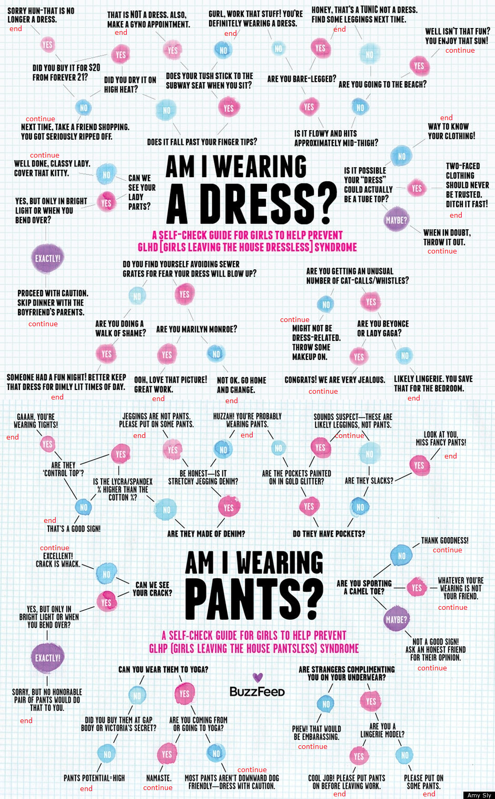

# Projekt SI - Clips

## Zasady uruchomienia

### Wymagania

- Java 17
- `java` i `javac` w PATH

### Uruchamianie

Zautomatyzowane kompilowanie i uruchomienie programu dostępne jest przez skrypt `start.bat` pod systemem windows. W przypadku gdyby nie działało skompilowany jar uruchomić możemy komendą

`java -Djava.library.path=.\lib -classpath .\bin;.\lib\CLIPSJNI.jar DressOrPants`

## Ważne informacje

Nasz graf decyzyjny był miejscami wolny do interpretacji, zamieszczamy więc poniżej ilustrację z naszym jego zrozumieniem. W celu umożliwienia użytkownikowi zadania więcej niż jednego pytania postanowiliśmy niektóre wierzchołki końcowe grafu uznać jedynie za komentarze a nie finalne werdykty :^)

## Nr indeksów autorów

- 148059
- 148347
